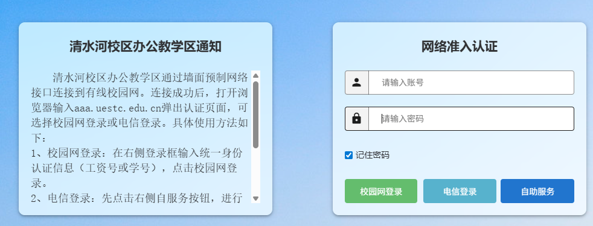
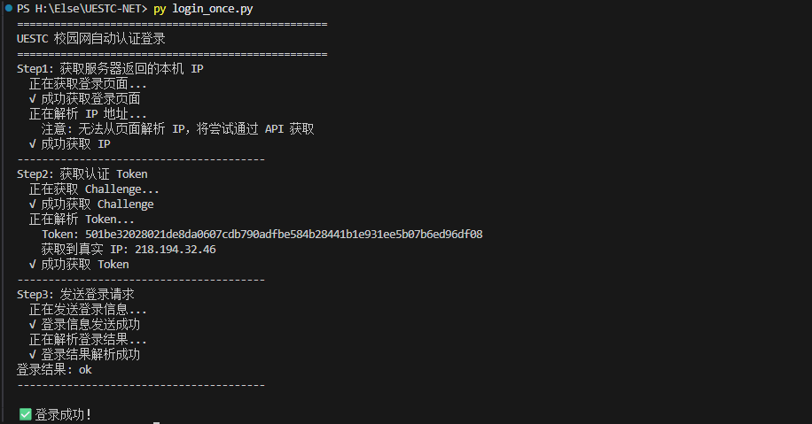
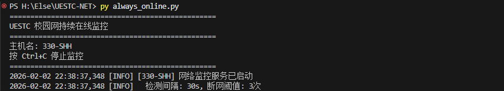

# UESTC 校园网自动认证登录（牛马专用版）

考虑到部分优秀学生（指我）科研努力，寒暑假回家也要猛猛学习，但是学校在放假后有时候会断电，教研室没有人在的情况下难以远程连接，特写了此脚本为祖国未来的人才保驾护航。（断电需要配置BIOS开启上电自启动，这个大家根据自己的电脑品牌自行Google）

该脚本是为了解决校园网不定时认证的问题，使用该脚本后电脑开机会自动检测校园网的连接，如果断开连接，则会自动重连；同时每隔一段时间检测网络情况，如果断开连接，也会自动重连，防止在家或者外地无法远程影响各位英才的科研发展。

## 介绍（正经版本）

轻量脚本，自动检测网络并在掉线时重登深澜 Portal，可选企业微信通知。

- [详情请点击这里(博客文章)](https://smarter.xin/posts/1f06d3bd/)

## 快速开始

1. 安装依赖：`py -m pip install -r requirements.txt`
2. 复制配置：`copy config.example.py config.py`
3. 编辑配置：`config.py` 中填入学号/密码，并根据实际网络设置：
   - 认证地址：主楼/研究院 `http://10.253.0.237`；寝室公寓 `http://10.253.0.235`
   - ac_id：主楼有线 `1`；寝室 `3`
   - domain：校园网 `@dx-uestc`（这个可能不需要，可以不填）；电信 `@dx`；移动 `@cmcc`
   - 可选：`test_ip`（默认 223.5.5.5）和 `test_urls`（HTTP 兜底探测列表）
4. 测试一次性登录：`py login_once.py`
5. 启动持续监控：`py always_online.py`

## 测试

1. 断开校园网


2. 启动一次性登录脚本


3. 持续监控


## 开机自启（任选其一）

### 方式 1：一键脚本（推荐）

直接双击运行 **`install_autostart.bat`** 即可。

- 自动创建开机自启任务（优先尝试任务计划程序，无需手动输入命令）。
- 同时也提供了 `run_background.bat` 用于单次后台启动。

### 方式 2：手动配置

如果你喜欢自己动手，可以选择以下方式之一（注意替换 `<Python路径>` 和 `<项目路径>`）：

#### A. 任务计划程序（管理员）

```cmd
schtasks /create /tn "UESTC-NET" /tr "\"<Python路径>\pythonw.exe\" \"<项目路径>\\always_online.py\"" /sc onlogon /rl HIGHEST /f
```

#### B. NSSM 服务（需自备 nssm.exe）

```cmd
nssm install UESTC-NET "<Python路径>\pythonw.exe" "<项目路径>\\always_online.py"
nssm set UESTC-NET AppDirectory "<项目路径>"
nssm set UESTC-NET Start SERVICE_AUTO_START
```

## 停止与卸载

如果你想停止后台运行的程序或取消开机自启，可以使用以下任一方法：

### 方法 1：使用停止脚本（最简单）

双击运行项目目录下的 **`uninstall.bat`**。

- 停止所有后台运行的脚本进程。
- 删除开机自启任务和启动文件。

### 方法 2：命令行手动停止

如果只想临时关闭当前运行的程序（不影响下次开机自启）：

```powershell
taskkill /F /IM pythonw.exe
```

*注意：这会强制关闭所有后台 Python 进程。*

### 方法 3：任务计划程序

手动管理自启任务：

1. `Win + R` 输入 `taskschd.msc`。
2. 找到 `UESTC-NET` 任务。
3. 右键选择“禁用”或“删除”。

## 微信通知（可选）

`config.py` 将 `notify_options['enabled']` 设为 `True` 并填入企业微信机器人 Webhook。

## 致谢

- [AutoLoginUESTC](https://github.com/b71db892/AutoLoginUESTC)
- [go-nd-portal](https://github.com/fumiama/go-nd-portal)
